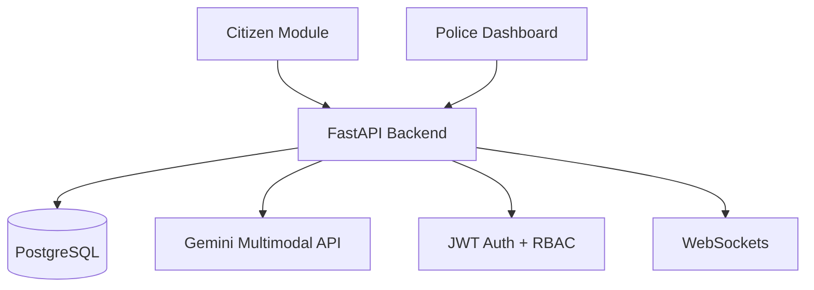

# SnapAid

**Edge-Powered Emergency Intelligence & Verification System**

No citizen should hesitate to report an emergency due to lack of trust, delay, or misinformation risk.

SnapAid is a real-time, AI-powered emergency intelligence platform that transforms citizen-submitted media into **structured, verified operational intelligence** for law enforcement agencies.

Instead of forwarding unstructured images or videos, SnapAid performs automated **incident classification**, **severity scoring**, **confidence evaluation**, and **authenticity validation** before streaming **structured incident packets** to a live **Police Command Dashboard**.

---

## Table of Contents

- [Overview](#overview)
- [Key Features](#key-features)
  - [Citizen Module](#citizen-module)
  - [Police Dashboard](#police-dashboard)
  - [Safety & Authenticity Layer](#safety--authenticity-layer)
  - [Multi-Language Support](#multi-language-support)
  - [Emergency Numbers Page](#emergency-numbers-page)
- [System Architecture](#system-architecture)
- [Technology Stack](#technology-stack)
- [Impact](#impact)
- [Demo](#demo)
- [Installation & Setup](#installation--setup)
  - [Backend](#backend)
  - [Frontend](#frontend)
- [Environment Variables](#environment-variables)
- [Security Considerations](#security-considerations)

---

## Overview

Modern emergency systems face two critical challenges:

- **Delayed triage** due to manual inspection of unstructured media
- **Increasing misinformation** caused by AI-generated or manipulated content

SnapAid addresses these gaps by converting raw media into **validated, severity-scored intelligence** before it reaches command centers. This enables faster prioritization, reduces false alarms, and improves operational trust.

---

## Key Features

### Citizen Module

- Capture or upload image/video instantly
- AI-powered incident classification
- Severity scoring (**1–5** scale)
- Confidence scoring
- AI-generated contextual summary
- Automatic timestamp and GPS capture
- Structured incident submission
- Civic participation points system
- **“Republic Day Civic Award”** badge recognition

### Police Dashboard

- Secure role-based login
- Real-time incident feed
- Interactive geospatial map visualization
- Severity and status filtering
- Incident detail view
- Status updates (**Pending / Dispatched / Closed**)
- Action logging

### Safety & Authenticity Layer

- AI-generated media detection
- Confidence scoring system
- Structured incident packet generation
- Reduced misinformation risk
- JWT-based authentication
- Secure password hashing

### Multi-Language Support

- English
- Tamil
- Hindi

### Emergency Numbers Page

Public access to:

- Police (**112**)
- Ambulance
- Fire
- Women Helpline
- Cybercrime Helpline

---

## System Architecture

### End-to-end flow

```mermaid
flowchart LR
  A[Citizen (Mobile Interface)] --> B[Media Upload<br/>(Image / Video)]
  B --> C[Gemini Multimodal AI Analysis]
  C --> D[Structured Incident Packet Generator]
  D --> E[FastAPI Backend]
  E --> F[(PostgreSQL Database)]
  E --> G[WebSocket Real-Time Streaming]
  G --> H[Police Command Dashboard]
```

### Core modules



---

## Technology Stack

### Frontend

- **React** (mobile-first UI)
- **Leaflet** (geospatial map visualization)

### Backend

- **FastAPI**
- **PostgreSQL**
- **SQLAlchemy ORM**
- **JWT Authentication**
- **WebSockets**

### AI

- **Gemini Multimodal API**
- Severity & confidence scoring logic

### Security

- **Bcrypt** password hashing
- Role-based access control (RBAC)
- Token-based authentication

---

## Impact

SnapAid enhances emergency response systems by:

- Reducing manual triage workload
- Minimizing response latency
- Decreasing false alarm volume
- Mitigating misinformation and synthetic media risks
- Improving structured prioritization of incidents

By converting raw media into verified intelligence, SnapAid strengthens operational reliability and modernizes public safety infrastructure.

---

## Demo

- **Live Demo:** _[Insert Live Deployment Link Here]_
- **Demo Video:** _[Insert Demo Video Link Here]_
- **GitHub Repository:** _[Insert GitHub Repository Link Here]_

---

## Installation & Setup

### Backend

```bash
pip install -r requirements.txt
uvicorn main:app --reload
```

### Frontend

```bash
npm install
npm start
```

---

## Environment Variables

Create a `.env` file (or configure your deployment environment) with:

- `DATABASE_URL`
- `JWT_SECRET_KEY`
- `GEMINI_API_KEY`

---

## Security Considerations

- Passwords are securely hashed.
- JWT authentication secures all protected routes.
- Role-based middleware restricts police dashboard access.
- Input validation ensures safe API interactions.
